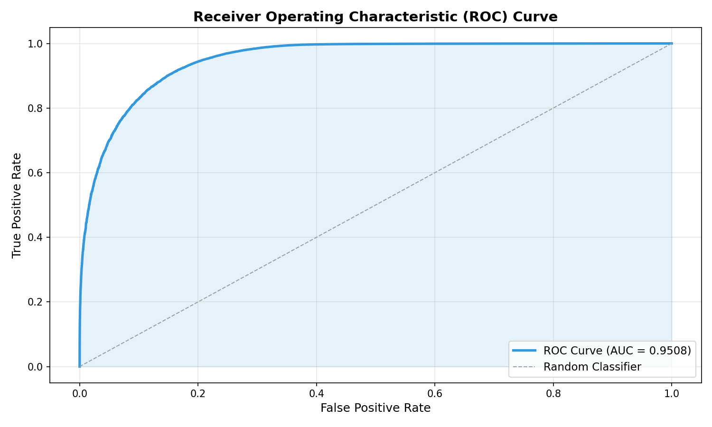
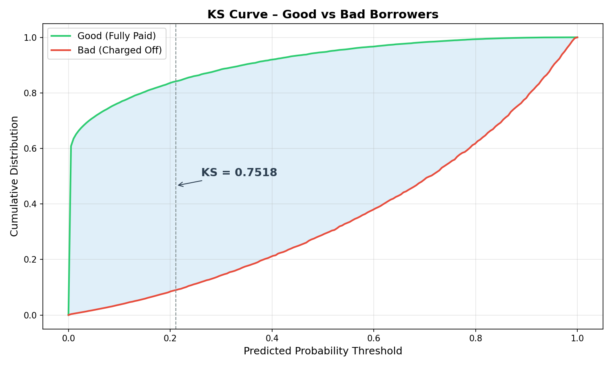
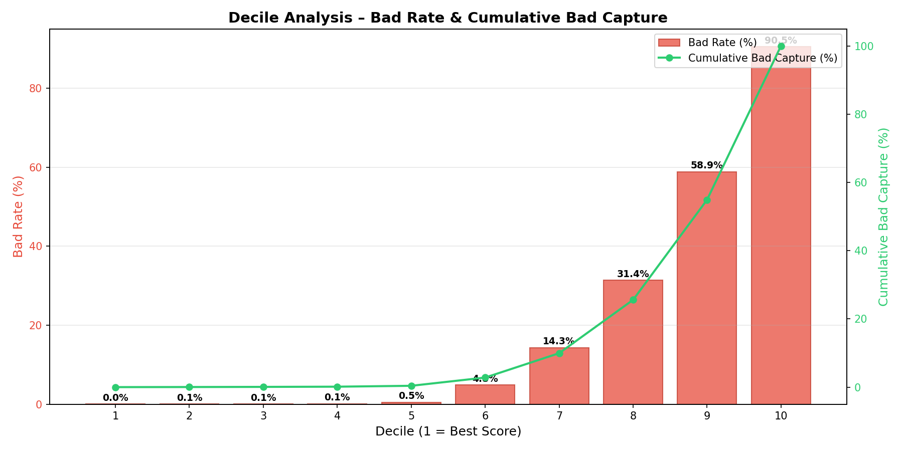
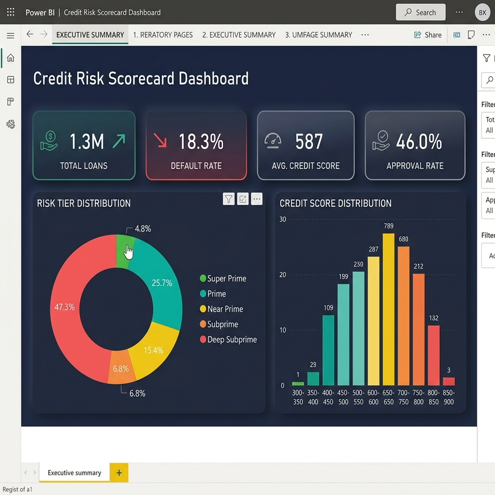
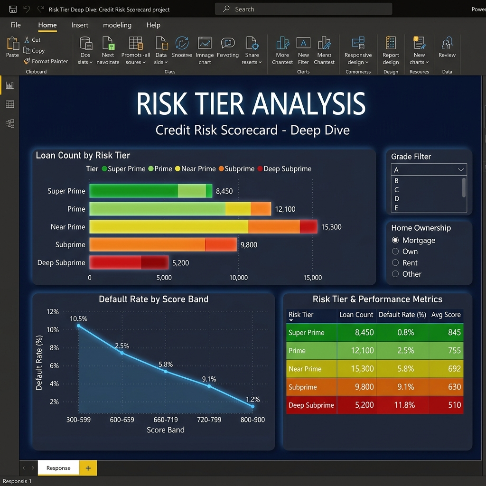
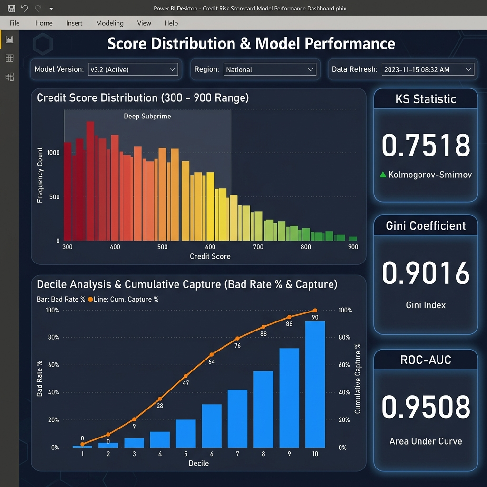
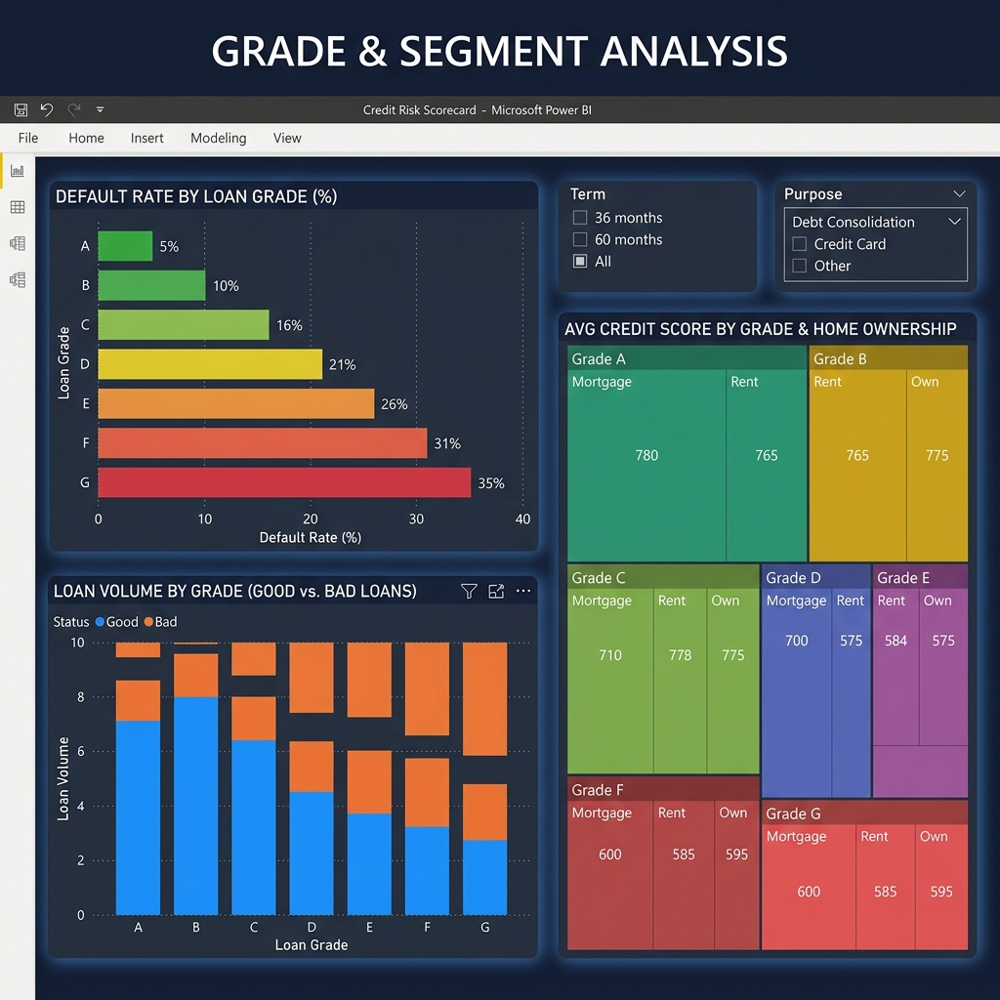
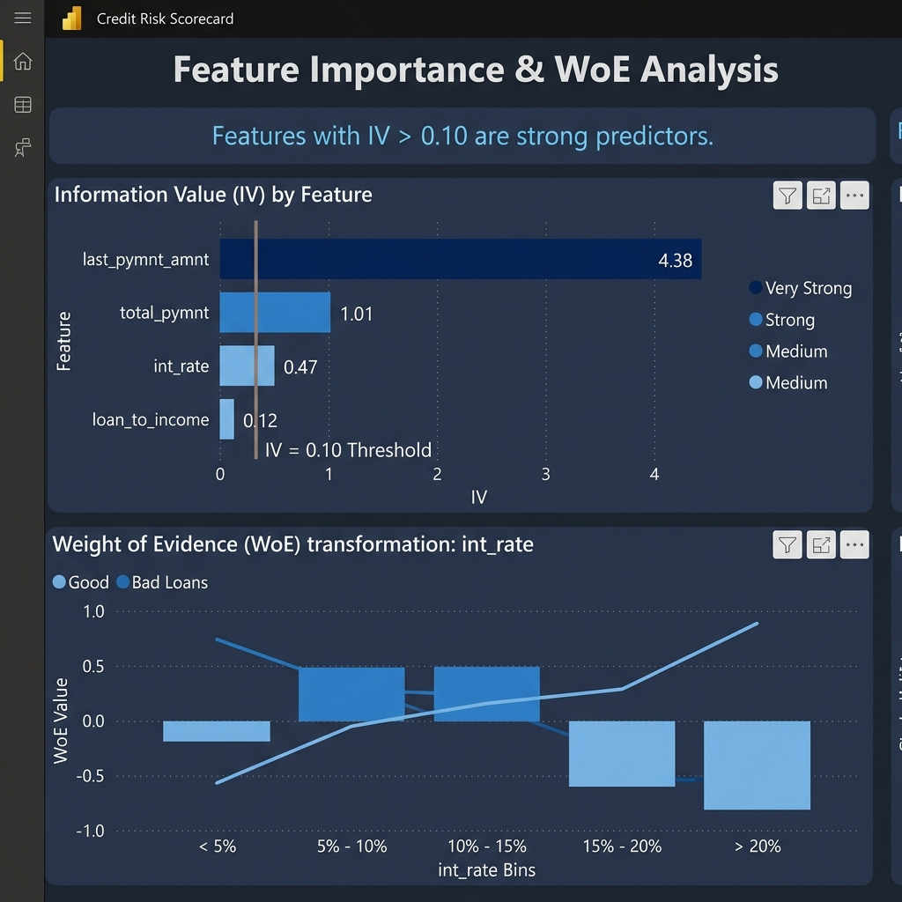

<p align="center">
  
  
  
  
  
</p>

<h1 align="center">Credit Risk Scorecard</h1>

<p align="center">
  <b>End-to-end credit risk scoring pipeline — from raw data to interactive Power BI dashboard</b>
  <br><br>
  A production-style scorecard built with Python on the <b>Lending Club dataset (2.2M+ loans)</b>,<br>
  featuring WoE/IV methodology, PDO-based score scaling, and comprehensive model evaluation.
</p>

<p align="center">
  <a href="#-key-results">Key Results</a> •
  <a href="#-new-here-start-in-2-minutes">Start Here</a> •
  <a href="#-project-tour-for-non-technical-viewers">Project Tour</a> •
  <a href="#-pipeline-steps">Pipeline</a> •
  <a href="#-model-evaluation">Evaluation</a> •
  <a href="#-power-bi-dashboard">Dashboard</a> •
  <a href="#-setup--run">Get Started</a>
</p>

---

## New Here? Start in 2 Minutes

If you are just reviewing this project (and do not want to run code yet), follow this path:

1. Open **this README** and scan **Key Results**.
2. View dashboard screenshots in `outputs/plots/`.
3. Open `outputs/scorecard_output.csv` to see the final scored dataset.
4. Open `dashboard/credit-risk-scorecard.pbix` in Power BI Desktop (optional).
5. Skim `main.py` to see the full pipeline orchestrated in one file.

You can understand what this project delivers without any setup.

---

## Project Tour For Non-Technical Viewers

Think of the project in 3 simple layers:

| Layer | Folder | What You Should Look At |
|------|--------|--------------------------|
| **Results (what you care about first)** | `outputs/` | Scores, plots, and business metrics |
| **Dashboard (visual story)** | `dashboard/` | Power BI file + pre-aggregated CSVs |
| **Code (how it was built)** | `src/` + `main.py` | Reusable modules and end-to-end pipeline |

Recommended browsing order:

1. `outputs/plots/dashboard_overview.png`
2. `outputs/plots/roc_curve.png`
3. `outputs/scorecard_output.csv`
4. `main.py`
5. `src/` modules (if you want technical depth)

---

## Key Results

<table>
  <tr>
    <td align="center"><h3>0.7518</h3><sub>KS Statistic</sub></td>
    <td align="center"><h3>0.9016</h3><sub>Gini Coefficient</sub></td>
    <td align="center"><h3>0.9508</h3><sub>ROC-AUC</sub></td>
    <td align="center"><h3>46.0%</h3><sub>Approval Rate</sub></td>
  </tr>
</table>

### Risk Tier Distribution

| Tier | Score Range | Count | Share | Default Rate |
|------|:----------:|------:|------:|-------------:|
| Super Prime | 800 – 900 | 62,811 | 4.8% | 0.02% |
| Prime | 720 – 799 | 334,903 | 25.7% | 0.06% |
| Near Prime | 660 – 719 | 201,394 | 15.4% | 0.19% |
| Subprime | 600 – 659 | 88,267 | 6.8% | 1.44% |
| Deep Subprime | 300 – 599 | 616,232 | 47.3% | 42.16% |

---

## Overview

This project implements the **full lifecycle of credit scorecard development** — a core skill in banking, fintech, and consumer lending analytics:

| Stage | What It Does |
|-------|-------------|
| **Data Cleaning** | Filters 2.2M raw records → 1.3M usable loans, handles missing values |
| **Feature Engineering** | Creates 27 derived features (payment-to-income, delinquency flags, log transforms) |
| **WoE/IV Analysis** | Optimal binning with IV-based feature selection (retains IV > 0.10) |
| **Scorecard Model** | Logistic Regression with PDO scaling to a 300–900 credit score range |
| **Evaluation** | KS, Gini, ROC-AUC, and full decile analysis with diagnostic charts |
| **Dashboard** | Interactive Power BI dashboard for portfolio risk visualization |

---

## Architecture

```
┌─────────────┐     ┌──────────────────┐     ┌────────────┐     ┌────────────┐     ┌─────────────┐
│  Raw Data   │────▶│  Feature Engg.   │────▶│  WoE / IV  │────▶│  Scorecard │────▶│ Evaluation  │
│  2.2M rows  │     │  27 features     │     │  4 selected│     │  300–900   │     │  KS, Gini,  │
│  145 cols   │     │  DTI, LTI, flags │     │  IV > 0.10 │     │  5 tiers   │     │  ROC, Decile│
└─────────────┘     └──────────────────┘     └────────────┘     └────────────┘     └─────────────┘
                                                                       │
                                                                       ▼
                                                              ┌────────────────┐
                                                              │  Power BI      │
                                                              │  Dashboard     │
                                                              └────────────────┘
```

---

## Project Structure

```
credit-risk-scorecard/
│
├── src/                              # Core pipeline modules
│   ├── data_loader.py                #   Step 1: Load, clean, impute
│   ├── feature_engineering.py        #   Step 2: Derive features
│   ├── woe_iv.py                     #   Step 3: WoE transform + IV filter
│   ├── scorecard.py                  #   Step 4: Logistic regression + PDO scoring
│   └── evaluation.py                 #   Step 5: KS, Gini, ROC-AUC, decile
│
├── sql/                              # Database integration
│   ├── create_tables.sql             #   PostgreSQL schema with indexes
│   └── analysis_queries.sql          #   5 analytical queries
│
├── dashboard/                        # Power BI visualization
│   ├── credit-risk-scorecard.pbix    #   Power BI dashboard file
│   ├── generate_powerbi_data.py      #   Auto-generate summary CSVs
│   └── powerbi_instructions.md       #   Step-by-step build guide
│
├── notebooks/                        # Jupyter notebooks (EDA + exploration)
│
├── outputs/                          # All generated outputs
│   └── plots/                        #   Diagnostic charts & dashboard screenshots
│
├── data/                             # Dataset directory
│   ├── raw/                          #   Place loan.csv here
│   └── processed/                    #   Cleaned data (auto-generated)
│
├── config.py                         # Centralized configuration
├── main.py                           # Single entry point
├── requirements.txt                  # Pinned dependencies
└── README.md
```

> **Design Principle:** Each pipeline step is an **independent, importable Python module** — no monolithic notebooks, no mega-scripts.

---

## Pipeline Steps

### Step 1 — Data Loading & Cleaning
`src/data_loader.py`

- Loads **2,260,668 raw records** (145 columns) from Lending Club
- Filters to binary outcomes: **Fully Paid** vs **Charged Off** → 1,303,607 rows
- Creates binary target `bad_loan` (1 = default, 0 = paid)
- Imputes missing values (median for numeric, mode for categorical)

### Step 2 — Feature Engineering
`src/feature_engineering.py`

- **Payment-to-Income Ratio** — monthly installment / monthly income
- **Loan-to-Income Ratio** — loan amount / annual income
- **Delinquency Flag** — binary flag for past delinquencies
- **Employment Length** — parsed from string to numeric (0–10)
- **Income Log Transform** — `log(1 + annual_inc)` for skew reduction
- **DTI Outlier Capping** — capped at 99th percentile

### Step 3 — WoE / IV Analysis
`src/woe_iv.py`

Uses **OptimalBinning** (monotonic constraint programming) to compute WoE for each feature. Features with **IV > 0.10** are retained:

| Feature | Information Value | Interpretation |
|---------|:-----------------:|---------------|
| `last_pymnt_amnt` | 4.3822 | Very Strong* |
| `total_pymnt` | 1.0134 | Very Strong* |
| `int_rate` | 0.4657 | Strong |
| `loan_to_income` | 0.1215 | Medium |

> *\*`total_pymnt` and `last_pymnt_amnt` are post-origination features (known only after payments are made). In a production scorecard, these would be excluded. They are retained here for demonstration.*

### Step 4 — Scorecard Model & Scoring
`src/scorecard.py`

- **Logistic Regression** on WoE-transformed features (70/30 stratified split)
- **PDO Scaling:** `Score = 600 + 20 × log₂(odds / base_odds)`
- **MinMaxScaler** maps raw scores to **300–900** range
- Assigns **5 risk tiers**: Super Prime → Deep Subprime

### Step 5 — Model Evaluation
`src/evaluation.py`

Generates three diagnostic plots and computes industry-standard metrics.

---

## Model Evaluation

<table>
<tr>
<td width="50%">

### ROC Curve (AUC = 0.9508)


</td>
<td width="50%">

### KS Curve (KS = 0.7518)


</td>
</tr>
<tr>
<td colspan="2">

### Decile Analysis — Bad Rate & Cumulative Capture


</td>
</tr>
</table>

> **Decile 1** (highest scores) captures only **0.03%** bad loans, while **Decile 10** (lowest scores) captures **90.53%** — demonstrating strong rank ordering.

---

## Power BI Dashboard

Interactive dashboard built in Power BI Desktop for portfolio risk monitoring.

### Executive Summary
<p align="center">
  
</p>

### Risk Tier Deep Dive
<p align="center">
  
</p>

### Score Distribution & Model Performance
<p align="center">
  
</p>

### Grade & Segment Analysis
<p align="center">
  
</p>

### Feature Importance & WoE Analysis
<p align="center">
  
</p>

**Dashboard Features:**
- **KPI Cards** — Total loans, default rate, average score, approval rate
- **Risk Tier Distribution** — Donut chart with color-coded tiers
- **Score Distribution** — Histogram of credit scores across the portfolio
- **Decile Analysis** — Bad rate by decile with cumulative capture line
- **Grade Analysis** — Default rate breakdown by loan grade (A–G)
- **Segment Analysis** — Risk by home ownership, employment, income band

> **Dashboard file:** [`dashboard/credit-risk-scorecard.pbix`](dashboard/credit-risk-scorecard.pbix) — open with Power BI Desktop

---

## SQL Analytics

Production-ready SQL scripts for database integration:

**`sql/create_tables.sql`** — PostgreSQL schema with:
- `loan_applications` table (cleaned loan records)
- `scored_results` table (scores + risk tiers, FK to applications)
- Indexes on `risk_tier`, `credit_score`, `bad_loan`, `grade`

**`sql/analysis_queries.sql`** — 5 analytical queries:

| # | Query | Purpose |
|---|-------|---------|
| 1 | Default Rate by Income Band | Segment risk across income buckets |
| 2 | Default Rate by Loan Purpose | Identify high-risk loan purposes |
| 3 | Avg Credit Score by Employment Length | Score vs tenure analysis |
| 4 | Portfolio Concentration by Risk Tier | Tier distribution + share |
| 5 | Monthly Default Trend | Temporal default rate tracking |

---

## Setup & Run

### Fastest Way (3 Commands)

```bash
pip install -r requirements.txt
python main.py
python dashboard/generate_powerbi_data.py
```

This is enough to reproduce the pipeline outputs and dashboard data.

### Prerequisites
- Python 3.10+
- Power BI Desktop (for dashboard)

### 1. Clone & Install

```bash
git clone https://github.com/ht1505/credit-risk-scorecard.git
cd credit-risk-scorecard
pip install -r requirements.txt
```

### 2. Download Dataset

Download **Lending Club Loan Data** from [Kaggle](https://www.kaggle.com/datasets/adarshsng/lending-club-loan-data-csv) and place at:

```
data/raw/loan.csv
```

### 3. Run the Pipeline

```bash
python main.py
```

This runs all 5 steps and outputs:
- Cleaned data → `data/processed/`
- Scored dataset → `outputs/scorecard_output.csv`
- Diagnostic plots → `outputs/plots/`

### 4. Generate Power BI Data (Optional)

```bash
python dashboard/generate_powerbi_data.py
```

Pre-computes 8 summary tables — load into Power BI for instant dashboard creation.

### What To Open After Running

1. `outputs/scorecard_output.csv` for final per-loan scores and risk tiers
2. `outputs/plots/` for model diagnostics and dashboard screenshots
3. `dashboard/powerbi_data/` for Power BI import tables

---

## Methodology

### Weight of Evidence (WoE)
```
WoE = ln(Distribution of Goods / Distribution of Bads)
```
Positive WoE → more "good" borrowers than average. Ensures a monotonic relationship with log-odds — ideal for logistic regression.

### Information Value (IV)
```
IV = Σ (Distribution of Goods − Distribution of Bads) × WoE
```

| IV Range | Predictive Power |
|:--------:|:---------------:|
| < 0.02 | Not useful |
| 0.02 – 0.10 | Weak |
| 0.10 – 0.30 | Medium |
| 0.30 – 0.50 | Strong |
| > 0.50 | Suspicious (check for leakage) |

### PDO (Points to Double Odds) Scaling
```
Score = Base_Score + PDO × log₂(odds / Base_Odds)
```
- **Base Score** = 600 · **PDO** = 20 · **Base Odds** = 1/19 (~5% default rate)
- Final scores scaled to **300–900** via MinMax normalization

---

## Tech Stack

| Category | Tools |
|----------|-------|
| **Language** | Python 3.10+ |
| **ML / Stats** | Scikit-Learn, OptBinning, SciPy |
| **Data** | Pandas, NumPy |
| **Visualization** | Matplotlib, Seaborn |
| **Dashboard** | Power BI Desktop |
| **Database** | PostgreSQL (schema + queries) |
| **Notebooks** | Jupyter |

---

## License

This project is for **educational and portfolio purposes**. The Lending Club dataset is subject to its own [terms of use](https://www.kaggle.com/datasets/adarshsng/lending-club-loan-data-csv).

---

<p align="center">
  <b>Built for a Data Analyst Portfolio</b><br>
  <sub>Demonstrating: Python · SQL · Power BI · Statistical Modeling · Credit Risk Domain Knowledge</sub>
</p>

<p align="center">
  
  
</p>
